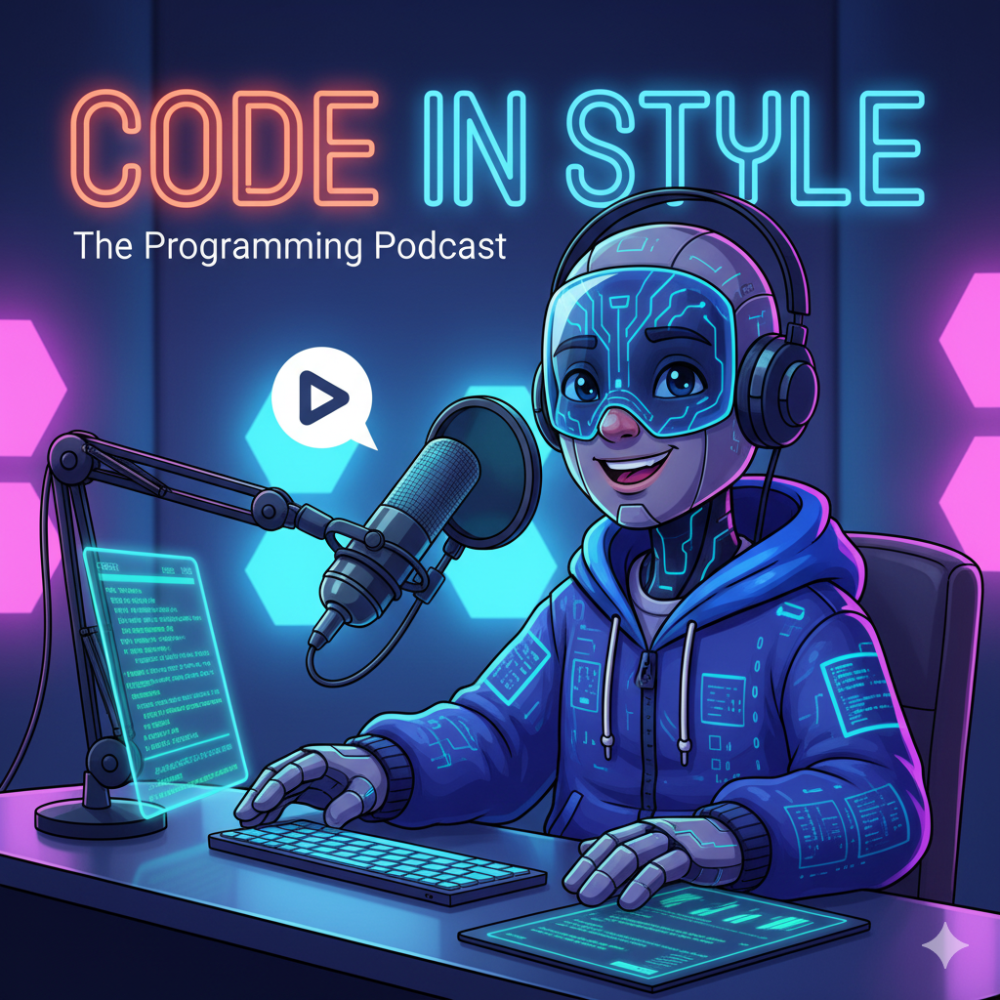

## 🎙️ Code in Style

### Porque até o código precisa de estilo.

## 🧠 Sobre o projeto

Code in Style é um podcast educativo e divertido criado para apresentar o mundo do CSS (Cascading Style Sheets) a quem está começando na área de tecnologia.

O objetivo é ensinar de forma simples, leve e envolvente o que é o CSS, como ele surgiu, para que serve e como transforma a web em algo visualmente incrível.

## 🎧 Conteúdo do projeto

Este repositório contém o roteiro e o texto do episódio piloto do podcast, que explica:

O que é o CSS e qual seu papel na web;

A origem e evolução do CSS desde os anos 90;

Como funciona o conceito de “cascata” nas folhas de estilo;

Curiosidades e fatos divertidos sobre o CSS;

Exemplos práticos e analogias para facilitar o aprendizado.

O conteúdo é voltado para novos programadores, estudantes e entusiastas da tecnologia, com uma linguagem acessível e toques de humor nerd.

## 💻 Tecnologias utilizadas

ChatGpt para roteirização e documentação;

ElevenLabs para criação da voz;

CapCut para edição de audio;

Google Gemini para criação de visual

## 💬 Autor

Criado por Augusto Belussi

[GitHub](https://github.com/Augusto-BelussiB) | [LinkedIn](https://www.linkedin.com/in/augustobelussi) | [Instagram](https://www.instagram.com/augusto_belussi)